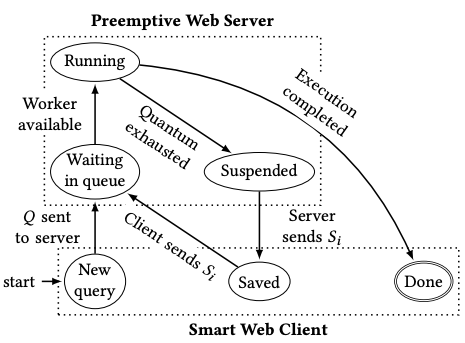
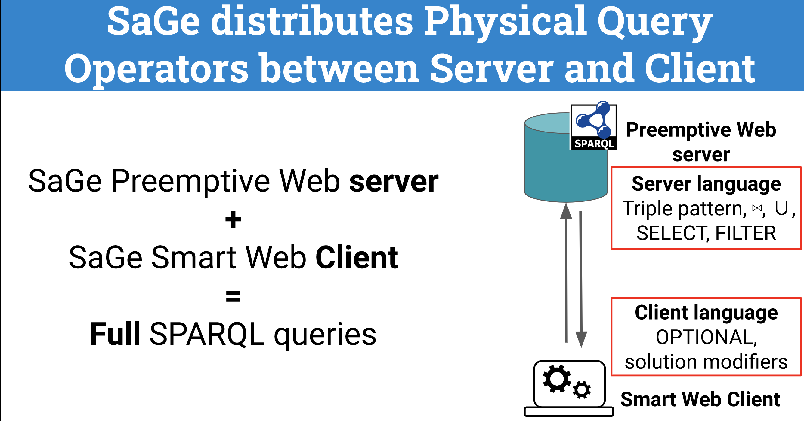

# What is SaGe?

SaGe is a SPARQL query engine for knowledge graphs that implements [Web preemption](#preemption). Thanks to web preemption, Sage ensures that any SPARQL query delivers complete results ie. Sparql queries cannot be interrupted after a quota of time fixed by knowledge graph provider. 

The complete approach and experimental results are available in a Research paper accepted at The Web Conference 2019. Thomas Minier, Hala Skaf-Molli and Pascal Molli. ["SaGe: Web Preemption for Public SPARQL Query services"](https://hal.archives-ouvertes.fr/hal-02017155/document) in Proceedings of the 2019 World Wide Web Conference (WWW'19), San Francisco, USA, May 13-17, 2019. [(slides)](https://docs.google.com/presentation/d/1zSMKwTq6N6IJFs4jFkOqRzpfooDDoLGhR-3yYRUSij8/present?slide=id.p)

An online demonstration is available at [sage.univ-nantes.fr](http://sage.univ-nantes.fr)

# What is web preemption?

Web preemption is the capacity of a Web server to suspend a running query after a fixed quantum of time and resume the
next waiting query. Web preemption is similar to time-sharing in operating systems where the web server plays the role of the CPU and web request plays the role of processes.

# SaGe General Architecture

The SPARQL engine includes a smart Sage client and a Sage SPARQL query server hosting RDF datasets as depicted in the figure below:

{:height="30%" width="30%"}

Preemptable sparql operators are natively implemented in the server. Non-preemptable sparql operators are processed in the smart client. We provide 2 implementations of the smart client:
* one in Java as an extension of JENA, we call it [sage-jena](https://github.com/sage-org/sage-jena). 
* one in pure javascript, we call it [sage-client](https://github.com/sage-org/sage-client).

The server itself is written in python and we call it [sage-engine](https://github.com/sage-org/sage-engine)

# Additional Software components

The web application used in the [online demo](http://sage.univ-nantes.fr) has its own repository [Sage-web](https://github.com/sage-org/sage-web). The demo uses a quite usefull widget [sage-widget] that allows a end-user to type a SPARQL query.

The sage-web application is able to handle several sage-server URLs. In this case all datasets provided by each SaGe servers are available in SaGe-web. This is a convenient way to build a SaGe portal for portal providers.

# Contact

SaGe is developped by the [GDD team](https://sites.google.com/site/gddlina/) of [Nantes University](https://english.univ-nantes.fr/universite-de-nantes-welcome-2405740.kjsp?RH=INSTITUTIONNEL_FR&RF=INSTITUTIONNEL_EN) within the [LS2N research lab](https://www.ls2n.fr/?lang=en).

We appreciate your feedback/comments/questions to be sent to our mailing list or our issue tracker on github.
