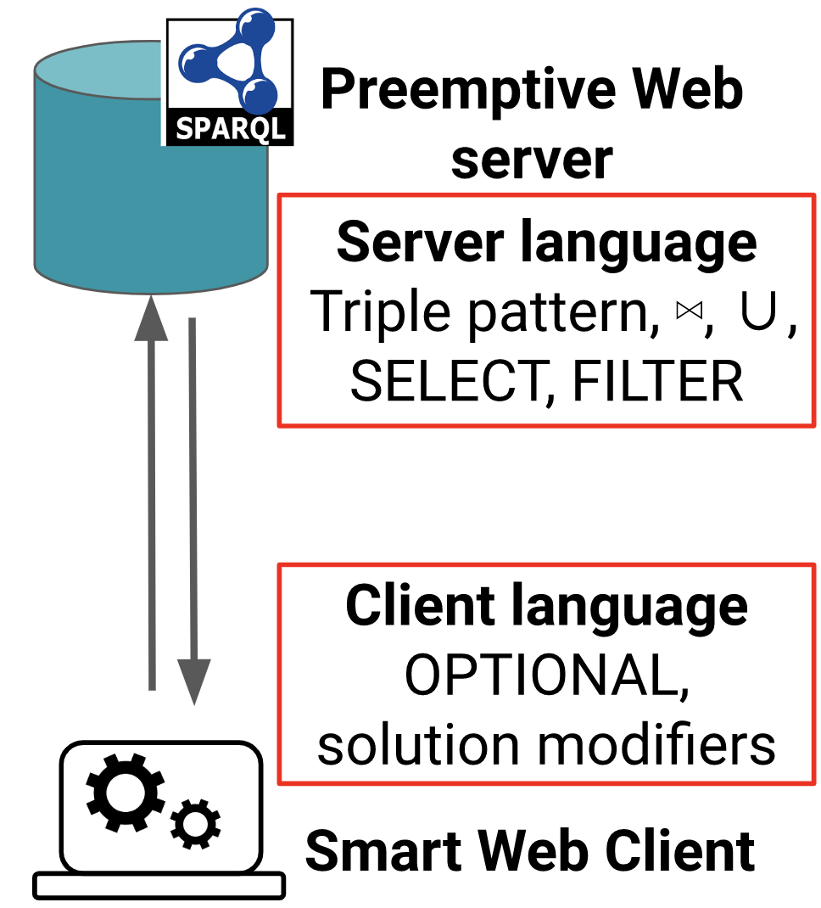

# What is SaGe?

SaGe is a [SPARQL](https://en.wikipedia.org/wiki/SPARQL) query engine for [Knowledge Graphs](https://en.wikipedia.org/wiki/Knowledge_Graph) that implements [Web preemption](#preemption). Web preemption ensures 2 main properties:
* A fair sharing of server resources among clients without quotas. A client cannot block the server with a long running query consuming all CPU and memory of the server. Web preemption greatly improves time for first results and average workload completion time.

* Any SPARQL query delivers complete results, i.e. SPARQL queries cannot be interrupted after a quota of time fixed by knowledge graph providers. This is a crucial property for building applications based on online knowledge graphs.

The complete approach and experimental results are available in a Research paper published at The Web Conference 2019. Thomas Minier, Hala Skaf-Molli and Pascal Molli. ["SaGe: Web Preemption for Public SPARQL Query services"](https://hal.archives-ouvertes.fr/hal-02017155/document) in Proceedings of the 2019 World Wide Web Conference (WWW'19), San Francisco, USA, May 13-17, 2019. [(slides)](https://docs.google.com/presentation/d/1zSMKwTq6N6IJFs4jFkOqRzpfooDDoLGhR-3yYRUSij8/present?slide=id.p)

An online demonstration is available at [sage.univ-nantes.fr](http://sage.univ-nantes.fr)

# What is web preemption?

Web preemption is the capacity of a web server to suspend a running query after a fixed quantum of time and resume the
next waiting query. Web preemption is similar to [time-sharing](https://en.wikipedia.org/wiki/Round-robin_scheduling) in operating systems where the web server plays the role of the CPU and web requests play the role of processes.

The figure below represents the possible states for a running query:

Web preemption relies on the interaction between a preemptable web server and a smart client. The smart client can be a small application running in the browser, a standard application running on a desktop computer or embedded in a web application.

* The smart client creates a query, submits it to the server within a standard web request and waits for answers. 

* The server picks the next waiting web request and start running it for a quantum of time. If the query terminates before the end of the quantum, then the server just sends results to the client. If the quantum is exhausted while the query is still running, the server suspends the query, saves its execution state 'Si' and returns the  current results and 'Si' to the client. Then, the server resumes the next waiting query in the waiting queue. 

* When the client receives an answer from the server, it consumes results and examines 'Si'. If 'Si' is not present, then the query is finished and results are complete. If not, the client sends 'Si' back to the server.

* When the server picks a query in the queue, if the query has a save state 'Si', then it restarts the query from this state.

The animation below illustrates how web preemption handles a query:

# What is the exact role of the Smart Client?

The fundamental role of the smart client is just to resend a suspended query to the server to continue the execution until the query terminates. The preemptable server implements some operators of  SPARQL query language, mainly because all SPARQL operators cannot be suspended and resumed in quasi-constant time. For example, interrupting an 'ORDER BY' operator supposes to save the state of all results of the query and is O(size(results)). Consequently, some operators of the SPARQL query language are moved to the smart client side. SPARQL operators are divided into two categories:
* one-mapping operators, i.e.,  operators that can be suspended and resumed in quasi constant time. This includes triple pattern selection with filters, joins (index-loop join and merge join operators), Union, projections.
* Full-mappings operators, i.e.,  operators that require materialization of results and consequently have serialization time proportional to the size of materialization. This includes OPTIONAL, GROUP BY and Aggregation functions.

One-mapping SPARQL operators are natively implemented in the server. Full-mapping SPARQL operators are processed in the smart client. This is resumed in the following figure:

{:height="30%" width="30%"}

Consequently, a query that includes full mapping operators is processed by sending one-mapping operators to the server with web preemption and the rest of query processing is managed within the smart client. For example, in the following query:

As the join of tp1 and tp2 can be processed in the server, it is sent to the server. Then, the OPTIONAL part of the query is managed by the smart client with the BindLeftJoin operator. We implemented  also an OptJoin operator that has better performance. As mappings from Join(tp1,tp2) is obtained from the server, the smart client calls back the server to perform the left-outer join with tp3.

# SaGe Software

## SaGe Smart Clients

Smart clients allow developers and end-users to execute SPARQL 1.1 queries. We provide 2 implementations of the smart client:
* [sage-jena](https://github.com/sage-org/sage-jena) is a java client written as an extension of JENA.
* [sage-client](https://github.com/sage-org/sage-client) is a JavaScript client.

## SaGe Server
The server [sage-engine](https://github.com/sage-org/sage-engine) is written in python. It handles natively a large part of the SPARQL language including triple patterns, Joins, Filters, Union, and  projection . Data can be stored in [HDT files](http://www.rdfhdt.org/), in a postgres database, or in a HBase database. It is easy to extend storage to other popular datastores such as Cassandra. All backends, except HDT,  now support SPARQL 1.1 update.

## SaGe Web Applications

The web application used in the [online demo](http://sage.univ-nantes.fr) has its own repository [Sage-web](https://github.com/sage-org/sage-web). The demo uses a widget [sage-widget](https://github.com/sage-org/sage-widget) that allows end-users to edit  a SPARQL query.

The sage-web application is able to handle several sage-server URLs. In this case, all datasets provided by SaGe servers are available in SaGe-web. This is a convenient way to build a SaGe portal for portal providers.

# SaGe Contact

SaGe is developped by the [GDD team](https://sites.google.com/site/gddlina/) of [Nantes University](https://english.univ-nantes.fr/universite-de-nantes-welcome-2405740.kjsp?RH=INSTITUTIONNEL_FR&RF=INSTITUTIONNEL_EN) within the [LS2N research lab](https://www.ls2n.fr/?lang=en).

We appreciate your feedback/comments/questions to be sent to our [mailing list](https://github.com/sage-org/sage-org.github.io) or our [issue tracker](https://github.com/sage-org/sage-engine/issues) on github.
